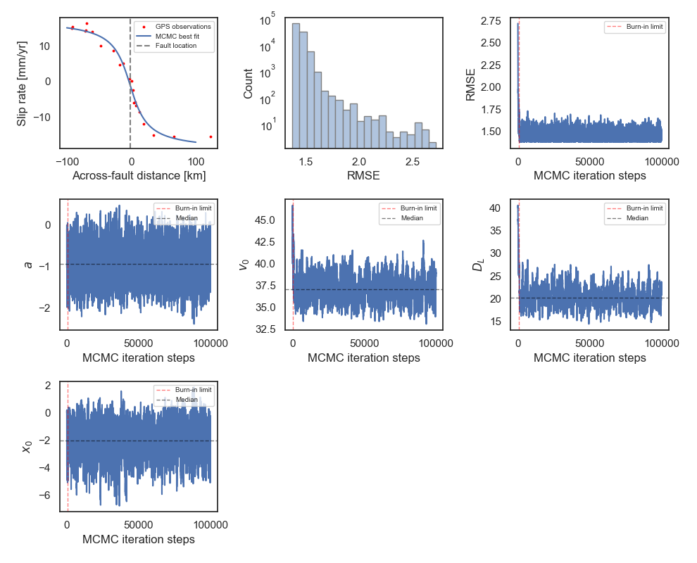
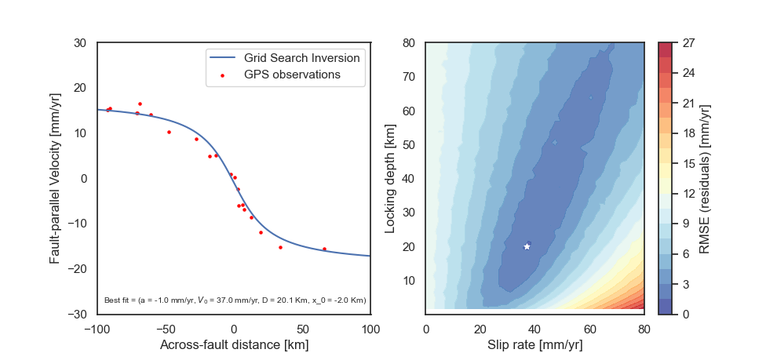

# Final Project, STAT-S610 - Statistical computing

### Fault Kinematics Along the San Andreas Fault from GPS Data Using Metropolis MCMC

Nicolás Castro-Perdomo

### Main Goal:
- Implement a random walk Metropolis sampling algorithm to estimate fault kinematic parameters $(a, v_0, D_L, x_0)$ in an elastic half-space dislocation model (e.g., Weertman and Weertman, 1964; Savage and Burford, 1973).

- The model describes the theoretical horizontal velocity profile across a vertical fault as a function of the distance $x$ from the fault:

$$
v(x) = a + \frac{v_0}{\pi} tan^{-1} \Big( \frac{x-x_0}{D_L} \Big)
$$

where $a$ is a constant vertical shift applied to the velocity profile, $v_0$ is the fault slip rate, $D_L$ is the fault locking depth, $x_0$ is the fault location and $x$ is the distance perpendicular to the fault.

### Model parameters

- The parameter domain is defined as follows:
    - x $\in$ [−150, 150] km
    - a $\in$ [-5, 5] mm/yr
    - $v_0$ $\in$ [0, 50] mm/yr
    - $D_L$ $\in$ [0, 50] km
    - $x_0$ $\in$ [−25, 25] km

- A Gaussian error model will be used, so that at any given location $x_j$, fault-parallel velocities satisfy:

$$
v_j = v(x_j) + \eta_j
$$

where $\eta_j$ $\sim\mathcal{N}$(0, 1) and all $\eta_j$ are independently identically distributed

### Metropolis MCMC results:

### Grid search inversion results:

